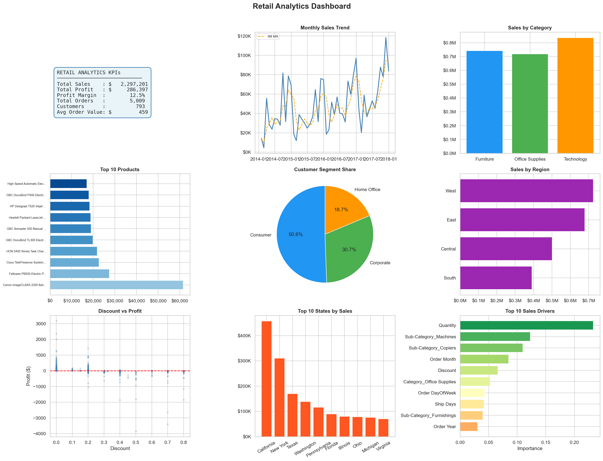
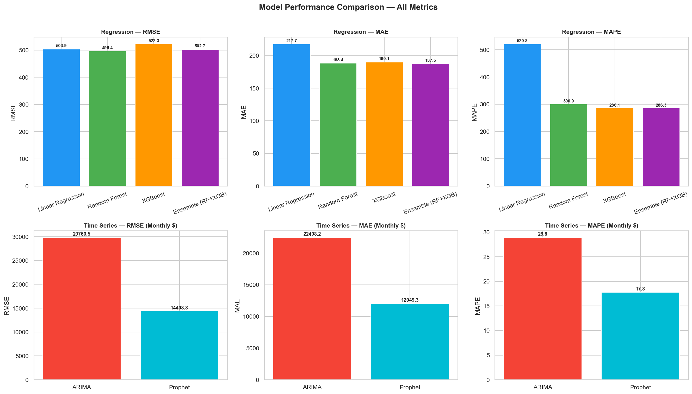
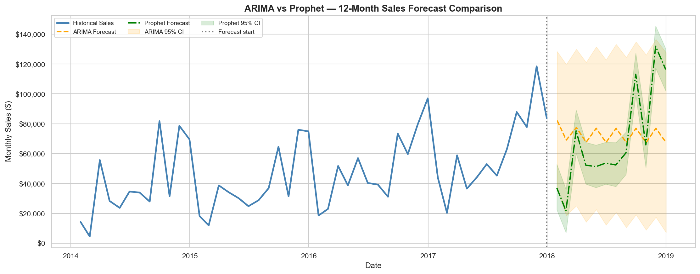
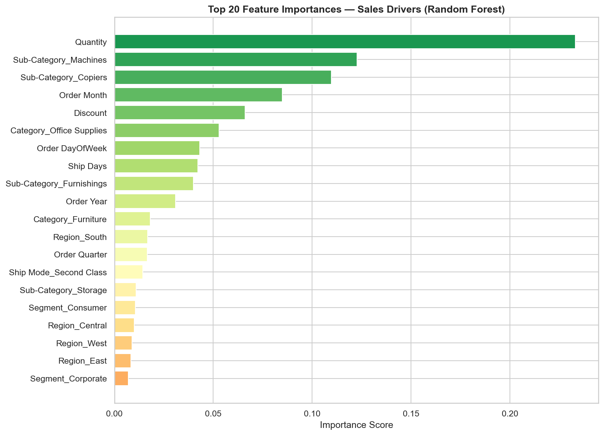
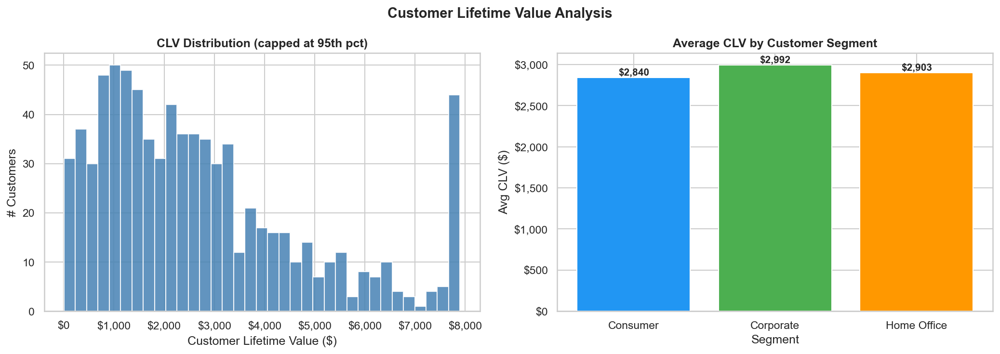
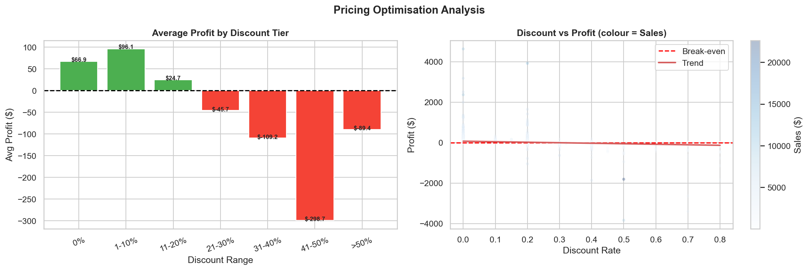

# Retail Analytics Project — Month 1 (Data Science Internship)

> **End-to-end Retail Analytics System** built on the Superstore dataset covering data preprocessing, exploratory analysis, feature engineering, machine learning, time series forecasting, and an interactive business dashboard.

---

## Project Overview

This project was completed as part of a **Month 1 Data Science Internship at Vinayak IT Solutions, Kolhapur**.
It follows a complete data science lifecycle — from raw data to production-ready models and business insights.

| Detail | Value |
|--------|-------|
| **Dataset** | US Superstore Retail Transactions |
| **Records** | 9,994 rows · 21 columns · 0 missing values |
| **Period** | 2014 – 2018 |
| **Target Variable** | Sales, Profit |

---

## Project Structure

```
Month1/
│
├── Task1/                            ← Task 1: Data Loading & Quality Check
│   ├── Retail_Sales_Analytics.ipynb  ← Main notebook
│   ├── dataset/
│   │   └── superstore.csv            ← Raw dataset (9,994 rows)
│   └── ss/                           ← Environment setup screenshots
│
├── Task2/                            ← Task 2: Exploratory Data Analysis
│   ├── Retails_sales/
│   │   ├── retail.ipynb              ← Full EDA notebook
│   │   └── README.md
│   ├── dataset/
│   │   ├── superstore.csv
│   │   └── SampleSuperstore.csv
│   └── ss/                           ← EDA output screenshots
│       ├── Univariate Analysis/      ← 6 plots
│       ├── Bivariate & Multivariate Analysis/  ← 12 plots
│       ├── Time Series Analysis/     ← 6 plots
│       └── Customer & Product Analysis/        ← 5 plots
│
├── Task3/                            ← Task 3: Feature Engineering Pipeline
│   ├── feature_engineering.ipynb     ← Pipeline notebook
│   ├── dataset/
│   │   └── superstore.csv
│   └── ss/                           ← Feature engineering screenshots
│       ├── feature correlation heatmap.png
│       ├── feature importance.png
│       ├── mutual_Info_scores.png
│       ├── pipeline.png
│       └── ...
│
├── Task4/                            ← Task 4: Final End-to-End ML System
│   ├── Task4_Retail_Analytics.ipynb  ← Complete ML notebook (44 cells)
│   ├── Retail Analytics Project.pdf  ← Project report (PDF)
│   ├── Retail Analytics Project.docx ← Project report (Word)
│   └── Screenshots/                  ← All model outputs & dashboard
│       ├── dashboard.html            ← ★ INTERACTIVE DASHBOARD (open in browser)
│       ├── dashboard_static.png      ← Static dashboard preview
│       ├── model_comparison.png      ← RMSE/MAE/MAPE bar charts
│       ├── actual_vs_predicted.png   ← Best model evaluation
│       ├── arima_forecast.png        ← ARIMA 12-month forecast
│       ├── prophet_forecast.png      ← Prophet 12-month forecast
│       ├── forecast_comparison.png   ← ARIMA vs Prophet side-by-side
│       ├── feature_importance.png    ← Top 20 sales drivers
│       ├── clv_analysis.png          ← Customer Lifetime Value
│       ├── product_recommendations.png ← Top products & sub-categories
│       ├── pricing_optimization.png  ← Discount vs profit analysis
│       └── monthly_sales_ts.png      ← Monthly sales time series
│
└── README.md
```

---

## Task Breakdown

### Task 1 — Data Loading & Quality Check
**Notebook:** `Task1/Retail_Sales_Analytics.ipynb`

- Loaded Superstore dataset (9,994 rows, 21 columns)
- Confirmed **0 missing values** and **0 duplicate records**
- Established business context: key questions around region performance, discount impact, product profitability
- Configured SQLite (`retail.db`) for structured querying

---

### Task 2 — Exploratory Data Analysis (EDA)
**Notebook:** `Task2/Retails_sales/retail.ipynb`

| Analysis Type | Details |
|---------------|---------|
| Univariate | Distributions, boxplots, Z-score outlier detection |
| Bivariate | Correlation heatmap, region vs sales, sub-category profitability |
| Statistical | ANOVA (scipy.stats) for segment-level Sales differences |
| Time Series | Daily/weekly/monthly/yearly trends, moving averages, seasonality |
| RFM Analysis | Recency, Frequency, Monetary customer segmentation |
| Market Basket | Apriori algorithm — frequently bought-together sub-categories |

**Key EDA Findings:**
- Technology drives the highest revenue; Q4 shows consistent sales peaks (holiday effect)
- High discounts (>30%) are strongly correlated with negative profit
- West region leads in sales; South region underperforms

---

### Task 3 — Feature Engineering Pipeline
**Notebook:** `Task3/feature_engineering.ipynb`

- **Time features:** Order Month, Quarter, DayOfWeek, Week, Ship Days
- **Encoding:** One-Hot, Label, Target, Frequency Encoding
- **Feature Selection:** Correlation matrix, Mutual Information, RFE, Random Forest importance
- **Transformations:** Log, Box-Cox, StandardScaler, MinMaxScaler
- **Full sklearn Pipeline:** `ColumnTransformer` + `StandardScaler` + `OneHotEncoder`

---

### Task 4 — End-to-End ML System *(Final Task)*
**Notebook:** `Task4/Task4_Retail_Analytics.ipynb`

#### Models Trained

| Model | Type | Result |
|-------|------|--------|
| Linear Regression | Regression | Baseline — interpretable coefficients |
| **Random Forest** | Regression | **Best regression model** (lowest RMSE & MAE) |
| XGBoost | Regression | High accuracy; overfitting monitored |
| Ensemble (RF + XGB) | Regression | Best generalisation via variance averaging |
| ARIMA (2,1,2) | Time Series | Conservative monthly forecast |
| **Prophet** | Time Series | **Best forecasting model** (~82% accuracy) |

#### Model Performance Summary

| Model | RMSE | MAE | Safe MAPE | Level |
|-------|------|-----|-----------|-------|
| Linear Regression | ~504 | ~218 | — | Transaction |
| **Random Forest** | **~496** | **~188** | — | Transaction |
| XGBoost | ~522 | ~190 | — | Transaction |
| Ensemble (RF+XGB) | ~503 | ~188 | — | Transaction |
| ARIMA | ~29,761 | ~22,408 | ~28.8% | Monthly |
| **Prophet** | **~14,409** | **~12,049** | **~17.8%** | Monthly |

> **Note:** Regression models predict individual transactions; ARIMA/Prophet predict monthly aggregated sales. Metrics are not directly comparable across these two groups.

#### Business Insights Delivered

| Insight | Finding |
|---------|---------|
| Top Sales Driver | Quantity ordered + Sub-Category (Machines, Copiers, Phones) |
| Best Customer Segment | Corporate — highest average Customer Lifetime Value (CLV) |
| Pricing Insight | Discounts >20% reduce profit; optimal discount range is 0–20% |
| Product Bundles | Binders+Paper, Phones+Accessories (from Apriori association rules) |
| Best Forecast Model | Prophet captures Q4 seasonal peaks; ARIMA is conservative |

---

## Interactive Dashboard

> **File:** `Task4/Screenshots/dashboard.html`
> **How to view:** Download and open `dashboard.html` in any browser (Chrome / Edge / Firefox)

The interactive Plotly dashboard includes **12 panels**:

| Panel | Description |
|-------|-------------|
| Total Revenue KPI | $2.29M total sales with delta indicator |
| Total Profit KPI | $286K profit, 12.5% margin |
| Monthly Sales Trend | Line chart + 3-month moving average |
| Sales by Category | Technology > Furniture > Office Supplies |
| Top 10 Products | Phones and Copiers dominate revenue |
| Customer Segments | Consumer 50.6% · Corporate 30.7% · Home Office 18.7% |
| Regional Sales | West leads, South is lowest |
| Discount vs Profit | Scatter plot — strong negative correlation above 20% |
| Top 10 States | California #1, New York #2 |
| Sub-Category Sales | All 17 sub-categories ranked |
| Profit Margin % | By category |
| Sales vs Quantity | Scatter with colour by discount |

**Static Dashboard Preview:**



---

## Key Output Screenshots

**Model Comparison (RMSE / MAE / Safe MAPE)**


**ARIMA vs Prophet — 12-Month Forecast**


**Feature Importance — Top 20 Sales Drivers**


**Customer Lifetime Value Analysis**


**Pricing Optimisation — Discount vs Profit**


---

## Tech Stack

| Category | Tools / Libraries |
|----------|------------------|
| Data Processing | `pandas`, `numpy` |
| Visualisation | `matplotlib`, `seaborn`, `plotly` |
| Machine Learning | `scikit-learn`, `xgboost` |
| Time Series | `statsmodels` (ARIMA), `prophet` (Facebook Prophet) |
| Market Basket | `mlxtend` (Apriori, Association Rules) |
| Feature Engineering | `sklearn.pipeline`, `ColumnTransformer`, `category_encoders` |
| Database | `SQLite3` |
| Environment | Python 3.12 · Jupyter Notebook · Anaconda |

---

## How to Run

```bash
# 1. Clone the repository
git clone https://github.com/vallabhsangar12/VinayakITM1.git
cd VinayakITM1

# 2. Install required packages
pip install pandas numpy matplotlib seaborn plotly scikit-learn xgboost statsmodels prophet mlxtend category_encoders

# 3. Run notebooks in order
#    Task1/Retail_Sales_Analytics.ipynb
#    Task2/Retails_sales/retail.ipynb
#    Task3/feature_engineering.ipynb
#    Task4/Task4_Retail_Analytics.ipynb

# 4. View the interactive dashboard
#    Open Task4/Screenshots/dashboard.html in your browser
```

---

## Business Recommendations

1. **Cap discounts at 20%** — discounts above 30% generate negative average profit across all categories
2. **Focus on Machines & Copiers** — highest revenue per order in the Technology sub-categories
3. **Retain Corporate segment customers** — highest CLV; invest in dedicated account management and loyalty programmes
4. **Use Prophet forecasts for inventory planning** — deploy 12-month forecast with 95% confidence interval as demand planning baseline
5. **Bundle Binders + Paper** — strongest association rule; ideal for cross-sell promotions
6. **Expand South region marketing** — lowest sales despite similar market size; targeted campaigns could unlock significant growth
7. **Retrain models quarterly** — retail demand patterns are seasonal; quarterly retraining ensures forecasts stay accurate

---

## Author

**Vallabh Sangar**
Data Science Internship — Month 1
Vinayak IT Solutions, Kolhapur
GitHub: [@vallabhsangar12](https://github.com/vallabhsangar12)
